# AGENT VISUAL STUDIO — Plan Maestro (Gantt)

> Renderizado automáticamente por GitHub con Mermaid.  
> Fuente de verdad de fases: ver [plan-master.md](./plan-master.md).

```mermaid
gantt
    title AGENT VISUAL STUDIO – Plan Maestro F0→F6
    dateFormat  YYYY-MM-DD
    axisFormat  %d-%b

    section F0 — Cimientos de datos
    F0-01 Schema Prisma canónico          :done,    f001, 2026-05-01, 1d
    F0-02 prisma migrate dev init         :done,    f002, after f001, 1d
    F0-03 Índices parciales raw SQL       :         f003, after f002, 1d
    F0-04 Repos Agency/Dept/WS/Agent      :         f004, after f002, 1d
    F0-05 RunRepository + RunStepRepo     :         f005, after f002, 1d
    F0-06 ConversationMessageRepo         :         f006, after f002, 1d
    F0-07 Migrar dashboard.service.ts     :         f007, after f004, 1d
    F0-08 Marcar workspaceStore @depr.    :         f008, after f007, 1d
    F0-09 Seed mínimo (1-1-1-1)           :         f009, after f002, 1d
    F0-10 Tests repositorios Prisma       :         f010, after f004, 1d

    section F1a — Ejecución LLM real
    F1a-01 LLMStepExecutor real           :         f1a01, 2026-05-06, 1d
    F1a-02 resolveModelPolicy() cascada   :         f1a02, after f1a01, 1d
    F1a-03 buildLLMClient() provider map  :         f1a03, after f1a01, 1d
    F1a-04 calculateCost() tabla precios  :         f1a04, after f1a03, 1d
    F1a-05 AgentExecutor intermedio       :         f1a05, after f1a01, 1d
    F1a-06 AgentExecutor.execute()        :         f1a06, after f1a05, 1d
    F1a-07 executeCondition() seguro      :         f1a07, after f1a01, 1d
    F1a-08 Conectar FlowExecutor→LLM      :         f1a08, after f1a06, 1d
    F1a-09 Test E2E Run→GPT-4o→completed  :         f1a09, after f1a08, 1d

    section F1b — Skills reales (MCP+N8N)
    F1b-01 executeTool() n8n_webhook      :         f1b01, 2026-05-13, 1d
    F1b-02 executeTool() mcp invokeMcp    :         f1b02, after f1b01, 1d
    F1b-03 buildToolDefinitions() OAI fmt :         f1b03, after f1b02, 1d
    F1b-04 executeToolCalls() despacho    :         f1b04, after f1b03, 1d
    F1b-05 N8nService.triggerWorkflow()   :         f1b05, after f1b01, 1d
    F1b-06 N8nService.syncWorkflows()     :         f1b06, after f1b05, 1d
    F1b-07 N8nService.getWorkflowsAsSkills:         f1b07, after f1b06, 1d
    F1b-08 SkillRepository CRUD           :         f1b08, after f1b05, 1d
    F1b-09 Test E2E skill n8n_webhook     :         f1b09, after f1b08, 1d

    section F2a — Orquestación jerárquica
    F2a-01 HierarchyOrchestrator.delegate :         f2a01, 2026-05-20, 1d
    F2a-02 getStepStatus() desde BD       :         f2a02, after f2a01, 1d
    F2a-03 routeTask() specialist/nivel   :         f2a03, after f2a01, 1d
    F2a-04 findSpecialistWithCapability() :         f2a04, after f2a03, 1d
    F2a-05 decomposeTask() bloques DELG.  :         f2a05, after f2a03, 2d
    F2a-06 consolidateResults() allSettled:         f2a06, after f2a05, 1d
    F2a-07 isBlocked() DELEGATION_TIMEOUT :         f2a07, after f2a02, 1d
    F2a-08 HierarchyStatusService         :         f2a08, after f2a01, 1d
    F2a-09 deriveParentStatus()           :         f2a09, after f2a08, 1d
    F2a-10 StatusChangeEvent              :         f2a10, after f2a09, 1d
    F2a-11 GET /runs/:id/status + /blocked:         f2a11, after f2a10, 1d
    F2a-12 Test E2E 4-niveles 4 RunSteps  :         f2a12, after f2a11, 1d

    section F2b — Propagación perfiles (paralelo F2a)
    F2b-01 propagateUp() solo orchestrat. :         f2b01, 2026-05-20, 1d
    F2b-02 findOrchestrator() en repos    :         f2b02, after f2b01, 1d
    F2b-03 generateOrchestratorPrompt()   :         f2b03, after f2b02, 1d
    F2b-04 Hook AgentRepo.create/delete   :         f2b04, after f2b03, 1d
    F2b-05 Test propagación system prompts:         f2b05, after f2b04, 1d

    section F3a — Gateway: WebChat + Telegram
    F3a-01 apps/gateway NestJS process    :         f3a01, 2026-05-27, 1d
    F3a-02 IChannelAdapter interface      :         f3a02, after f3a01, 1d
    F3a-03 WebChatAdapter WebSocket       :         f3a03, after f3a02, 1d
    F3a-04 TelegramAdapter grammY         :         f3a04, after f3a02, 1d
    F3a-05 SessionManager GatewaySession  :         f3a05, after f3a01, 1d
    F3a-06 AgentResolver ChannelBinding   :         f3a06, after f3a01, 1d
    F3a-07 MessageDispatcher AgentExecutor:         f3a07, after f3a06, 1d
    F3a-08 ChannelRouter registro adapters:         f3a08, after f3a07, 1d
    F3a-09 WS endpoint status-stream      :         f3a09, after f3a08, 1d
    F3a-10 Test E2E Telegram→respuesta    :         f3a10, after f3a09, 1d

    section F3b — Security layer (paralelo F4a)
    F3b-01 Logto JWT middleware           :         f3b01, 2026-05-27, 1d
    F3b-02 Helmet CSP + HSTS              :         f3b02, after f3b01, 1d
    F3b-03 CORS ALLOWED_ORIGINS           :         f3b03, after f3b01, 1d
    F3b-04 Rate limiting 60 req/min       :         f3b04, after f3b01, 1d
    F3b-05 AES-256-GCM ChannelConfig      :         f3b05, after f3b01, 1d
    F3b-06 AES-256-GCM N8nConnection      :         f3b06, after f3b05, 1d
    F3b-07 AuditEvent logger              :         f3b07, after f3b05, 1d

    section F4a — Integración N8N completa
    F4a-01 N8nService completo            :         f4a01, 2026-06-03, 1d
    F4a-02 CRUD N8nConnection REST        :         f4a02, after f4a01, 1d
    F4a-03 WebhookAdapter n8n→agentes     :         f4a03, after f4a01, 1d
    F4a-04 N8nWorkflowNode React Flow     :         f4a04, after f4a01, 1d
    F4a-05 Panel propiedades nodo n8n     :         f4a05, after f4a04, 1d
    F4a-06 Sync workflows auto al guardar :         f4a06, after f4a02, 1d
    F4a-07 Test E2E Flow nodo n8n_webhook :         f4a07, after f4a06, 1d

    section F4b — N8N Studio Helper
    F4b-01 N8nStudioHelper.createWorkflow :         f4b01, 2026-06-10, 2d
    F4b-02 Tool create_n8n_workflow       :         f4b02, after f4b01, 1d
    F4b-03 Tool list_n8n_workflows        :         f4b03, after f4b01, 1d
    F4b-04 Tool assign_skill_to_agent     :         f4b04, after f4b02, 1d
    F4b-05 Test prompt→Skill en BD        :         f4b05, after f4b04, 1d

    section F5 — Canales adicionales
    F5-01 WhatsAppAdapter Baileys         :         f5a01, 2026-06-17, 2d
    F5-02 Reconexión auto WA session BD   :         f5a02, after f5a01, 1d
    F5-03 SlackAdapter Slack Bolt         :         f5a03, after f5a01, 2d
    F5-04 DiscordAdapter discord.js       :         f5a04, after f5a03, 2d
    F5-05 UI gestión canales Config Surf  :         f5a05, after f5a03, 2d
    F5-06 Test E2E WhatsApp→respuesta     :         f5a06, after f5a02, 1d

    section F6 — Frontend Canvas/Ops/Config (continuo)
    F6-01 Auditar canvas React Flow       :         f6a01, 2026-05-11, 1d
    F6-02 Nodos mínimos (8 tipos)         :         f6a02, after f6a01, 3d
    F6-03 Panel propiedades por nodo      :         f6a03, after f6a02, 2d
    F6-04 Guardar Flow.spec en BD         :         f6a04, after f6a02, 2d
    F6-05 Sidebar jerarquía navegable     :         f6a05, after f6a01, 2d
    F6-06 Timeline runs en tiempo real    :         f6a06, 2026-05-28, 2d
    F6-07 Árbol estado por run            :         f6a07, after f6a06, 2d
    F6-08 Panel detalle nodo              :         f6a08, after f6a07, 2d
    F6-09 Botón Reintentar delegación     :         f6a09, after f6a07, 1d
    F6-10 Panel aprobaciones pending      :         f6a10, after f6a07, 2d
    F6-11 Settings modelo por scope       :         f6a11, 2026-06-04, 2d
    F6-12 Budget policy por scope         :         f6a12, after f6a11, 2d
    F6-13 Gestión canales ChannelConfig   :         f6a13, after f6a11, 2d
    F6-14 Gestión conexiones n8n          :         f6a14, 2026-06-10, 2d
```



---

## Dependencias críticas del camino crítico

```
F0 → F1a → F1b → F2a ─┐
                        ├──► F3a → F3b → F4a → F4b
F2a ──────────► F2b ───┘
F3a + F3b ──────────────────────────────► F5
F1a-09 ─────────────────────────────────► F6 (continuo)
```

## Criterios de cierre por milestone

| Milestone | Criterio de cierre |
|-----------|-------------------|
| F0 | F0-01 → F0-10 completadas, seed ejecutable, tests verdes |
| F1a | Test E2E `Run→GPT-4o→RunStep.status=completed` pasa |
| F1b | Test E2E skill `n8n_webhook` ejecuta y retorna resultado real |
| F2a | Test E2E 4 niveles → 4 `RunStep` en BD |
| F2b | Test propagación: agregar Agent → system prompts actualizados |
| F3a | Test E2E Telegram→GatewaySession→AgentExecutor→respuesta |
| F3b | AES-256-GCM activo, JWT middleware funcionando, audit log activo |
| F4a | Test E2E Flow con nodo `n8n_webhook` ejecuta workflow real |
| F4b | Test prompt "crea workflow…" → Skill registrada en BD |
| F5 | Test E2E WhatsApp→GatewaySession→agente→respuesta |
| F6 | Canvas, Operations, Config superficies integradas con backend |
